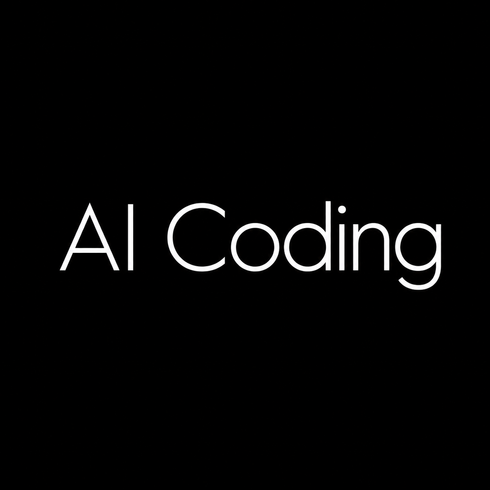

# AI Coding

<p align="center">
  
</p>

<p align="center">
  <strong>A desktop control center for AI coding tools, model providers, routing, memory, sessions, MCP, Skills, and prompts.</strong><br />
  Switch freely between Chinese domestic model providers and overseas model providers across Claude Code, Claude Desktop, Codex, Gemini CLI, OpenCode, OpenClaw, Hermes, Grok Build, Pi, and bincode.
</p>

AI Coding is not another chat wrapper. It is a practical desktop toolkit for developers who use multiple AI coding CLIs and want one clean place to manage providers, API keys, model routes, local proxy settings, MCP servers, Skills, prompts, session history, shared memory, and usage analytics.

If you often switch between DeepSeek, Kimi, Zhipu GLM, Qwen/Bailian, SiliconFlow, ModelScope, Claude, Gemini, OpenAI-compatible APIs, AWS Bedrock, or custom gateways, AI Coding is designed to make that workflow faster and less fragile.

## Screenshots

> All screenshots below are from the current AI Coding app.

| Cross-Tool Memory Sync | Categorized Provider Picker |
| --- | --- |
|  |  |

| macOS-Style Dynamic Dock | Export Sessions To Markdown |
| --- | --- |
|  |  |


## Highlights

- **Chinese and overseas model switching**: providers are organized into Domestic Models, Custom Configuration, and Overseas Models, so users can quickly choose the right route for each AI coding tool.
- **10 supported AI coding apps**: Claude Code, Claude Desktop, Codex, Gemini CLI, OpenCode, OpenClaw, Hermes, Grok Build, Pi, and bincode. bincode is integrated as an OpenCode-compatible app with its own branding and switch entry.
- **Cross-tool memory synchronization**: push Claude Code memory from `~/.claude/CLAUDE.md` to Codex, Gemini, Hermes, OpenCode, and OpenClaw with one click.
- **Session management and Markdown export**: browse local AI coding sessions, search history, copy resume commands, delete sessions, and export the current session as a `.md` file for archiving or sharing.
- **Apple-inspired desktop UI**: dark mode by default, warm Claude-style orange accents, large rounded corners, glass effects, and a macOS Dock-style bottom navigation with hover magnification and app labels.
- **Unified MCP management**: add, edit, validate, import, and sync MCP servers across multiple coding apps instead of maintaining separate config files manually.
- **Unified Skills management**: install, import, export, update, discover, and sync Skills. AI Coding can use the unified `~/.agents/skills` layout for cleaner cross-tool skill sharing.
- **Prompt management**: centralize prompts for different tools, import existing prompt files, edit them in one place, and sync them back to target apps.
- **Local proxy and routing**: configure local routing, model mapping, provider health checks, automatic failover, circuit breaker behavior, and request transformation for mixed provider workflows.
- **Usage analytics and cost insight**: parse local sessions and proxy request logs to track requests, token usage, model/provider distribution, trends, and estimated cost.
- **Backup and migration**: import/export app configuration, sync through WebDAV/S3, configure global proxy settings, and migrate between machines more easily.

## Supported Apps

| App | What AI Coding Manages |
| --- | --- |
| Claude Code | CLI providers, memory, prompts, MCP, sessions, usage |
| Claude Desktop | Desktop provider routing and configuration |
| Codex | Providers, prompts, MCP, memory target, sessions, usage |
| Gemini CLI | Providers, prompts, MCP, memory target, sessions, usage |
| OpenCode | OpenCode-compatible providers, MCP, Skills, memory target |
| OpenClaw | Providers, tools, default agents, memory target |
| Hermes | Hermes memory, Skills, MCP, and provider-related config |
| Grok Build | xAI provider configuration, OAuth and sessions (hidden by default) |
| Pi | Providers, prompts, sessions and usage (hidden by default) |
| bincode | OpenCode-compatible app entry and model switching |

## Why It Exists

AI coding tools are powerful, but their configuration is scattered: every CLI has its own provider file, memory file, MCP format, prompt location, and session storage. AI Coding brings these moving parts into one desktop app so switching models, sharing memory, managing Skills, and exporting sessions becomes a normal workflow instead of a collection of manual edits.

## Open-Source Build

This repository is prepared as an open-source build for self-hosting, learning, and secondary development.

- The activation-code gate has been removed from this open-source version.
- You do not need an activation code to run this repository build.
- Commercial or private builds can reintroduce licensing separately if needed.
- Some internal storage paths may keep historical names for compatibility with existing user data.
- OAuth-related features require your own Client ID / Client Secret through environment variables. Do not commit secrets to the repository.

## Download

### macOS

Download the current Apple Silicon build:

[Download AI Coding v3.22.0 for macOS Apple Silicon](downloads/AI-Coding-v3.22.0-macOS-aarch64.dmg)

Open the `.dmg` file, then drag **AI Coding** into the Applications folder.

#### macOS says the app "is damaged" or won't open

The app is not notarized with Apple yet, so Gatekeeper may block the first launch after download. The file itself is fine. Fix it either way below:

- Open **System Settings → Privacy & Security**, scroll down to the AI Coding message, and click **Open Anyway**; or
- Run this once in Terminal after copying the app into Applications, then open it normally:

```bash
xattr -cr "/Applications/AI Coding.app"
```

> A GitHub Release asset is still the recommended distribution format for larger releases. This repository also keeps the current `.dmg` under `downloads/` so users can download it directly from the project page.

The macOS build output is usually located at:

```text
src-tauri/target/release/bundle/macos/AI Coding.app
src-tauri/target/release/bundle/dmg/
```

## Development

### Requirements

- Node.js 20+
- pnpm
- Rust
- Tauri development environment

### Run In Development

```bash
pnpm install
pnpm tauri dev
```

### Build Desktop App

```bash
pnpm tauri build
```

## Project Structure

```text
src/          React + TypeScript frontend
src-tauri/    Rust + Tauri backend
assets/       Branding assets and product screenshots
```

## License

MIT
