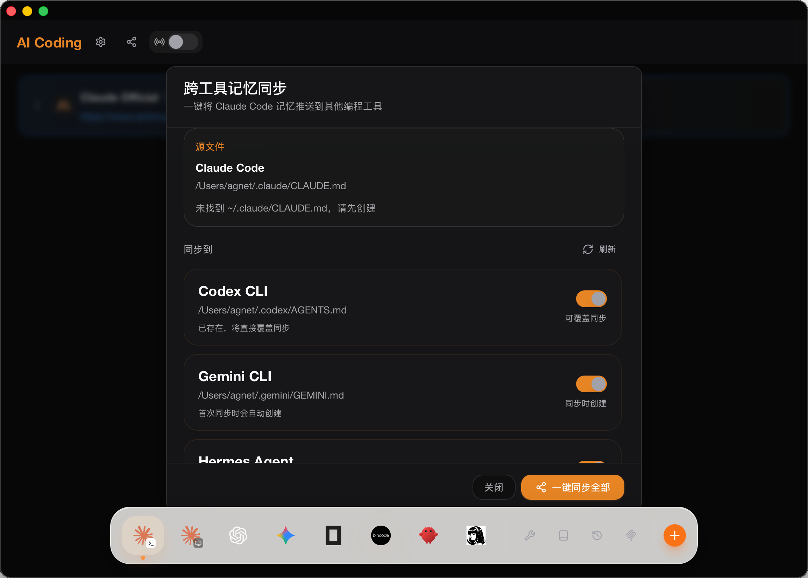
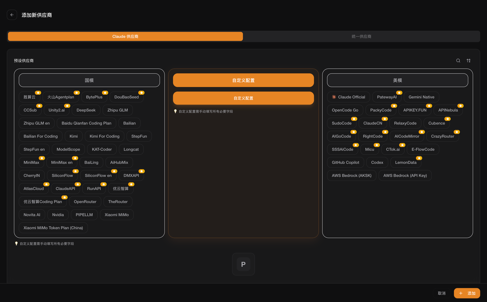
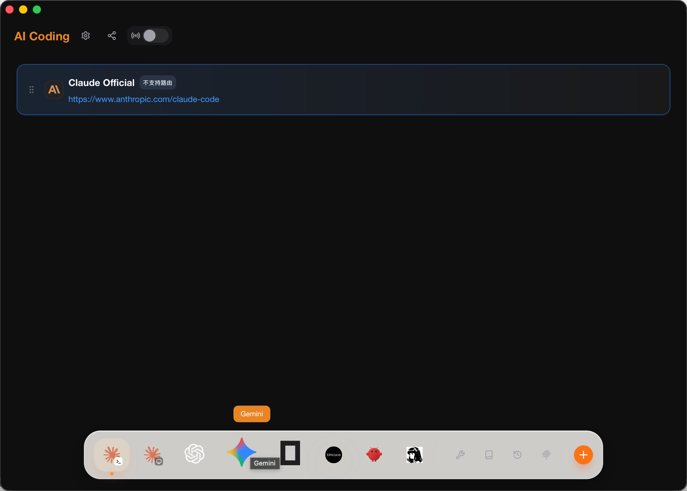
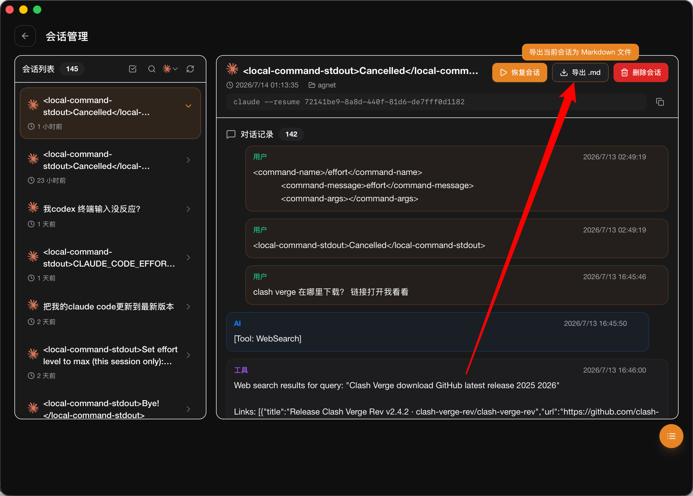
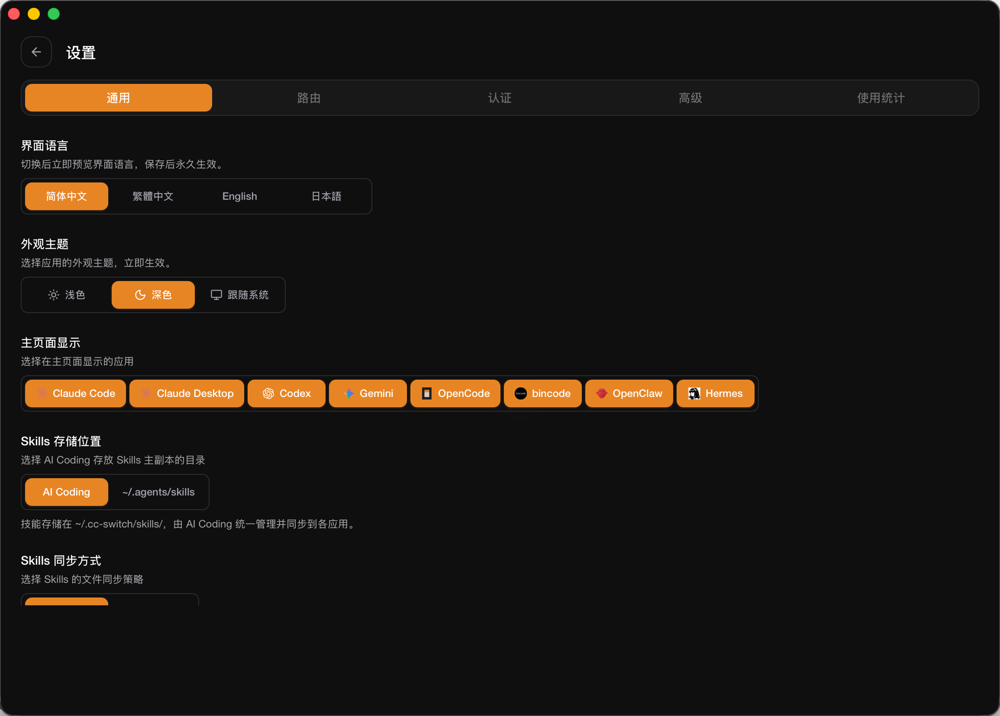

# AI Coding Documentation

AI Coding is an open-source desktop control center for developers who want to switch freely between domestic and international AI coding models without rewriting CLI configuration files by hand.

It manages providers, routing, prompts, skills, MCP servers, sessions, environment variables, and workspace settings for multiple AI coding tools from one polished macOS-style interface.

## What Makes AI Coding Different

- **Domestic and international model switching**: add Chinese providers and overseas providers in separate sections, then switch the active model for each coding tool.
- **Multi-tool provider management**: manage Claude Code, Claude Desktop, Codex, Gemini CLI, OpenCode, OpenClaw, Hermes, and Bincode.
- **Bincode support**: Bincode is integrated as an OpenCode-compatible target so it can use the same provider switching flow.
- **Cross-tool memory sync**: sync Claude Code memory into other coding tools with one click.
- **Session viewer and Markdown export**: browse local coding sessions and export a selected conversation to a `.md` file.
- **MCP, Skills, prompts, and agents**: keep tool extensions organized from one place instead of editing scattered config files.
- **Apple-inspired UI**: dark charcoal background, warm Claude-style orange accent, translucent panels, and a floating Dock with dynamic hover scaling.
- **Open-source friendly build**: the public source build is intended to run without commercial activation.

## Screenshots

### Cross-Tool Memory Sync



### Provider Categories

AI Coding separates provider presets into domestic models, custom configuration, and overseas models so users can find the right API provider quickly.



### Dynamic Dock

The bottom Dock keeps the most important tools one click away and uses a macOS-style magnification effect on hover.



### Markdown Session Export

Claude Code sessions can be opened, reviewed, resumed, and exported as Markdown.



### Settings

The settings page controls language, theme, visible apps, Skills storage, sync strategy, routing, authentication, and usage statistics.



## Downloading The App

For end users, publish the compiled macOS installer or app bundle from GitHub Releases.

Recommended release assets:

- `AI-Coding-v3.16.2-macOS-aarch64.dmg` for Apple Silicon Macs.
- `AI-Coding-v3.16.2-macOS.zip` as a simple drag-to-Applications archive.

Developers can also build locally:

```bash
pnpm install
pnpm tauri build
```

The macOS app bundle is generated under:

```text
src-tauri/target/release/bundle/macos/AI Coding.app
```

## Open Source Notes

The open-source edition should be easy to study, run, and modify. Commercial activation gates are not required for the public repository build. If a private commercial build is maintained separately, keep that logic out of the public GitHub documentation and screenshots.

